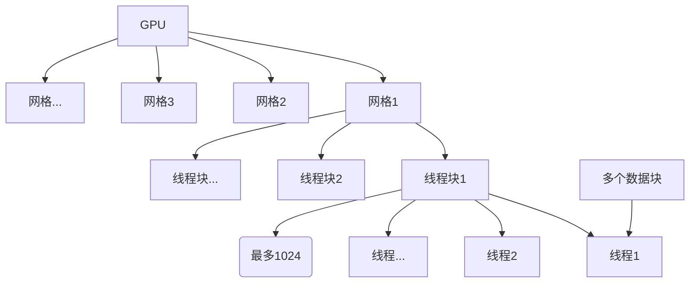

[TOC]

查询GPU信息（2.5）

> HPC高性能计算：旨在通过使用多个处理器和计算机来处理高度复杂的计算任务。HPC系统通常使用高速网络连接，以便允许各个处理器之间的快速通信和协作，以实现最佳的性能和效率。

> 并行计算通常涉及两个不同的计算技术领域：
> - 计算机架构（硬件方面）
>   - 关注的是在结构级别上支持并行性
>
> - 并行程序设计（软件方面）
>   - 关注的是充分使用计算机架构的计算能力来并发地解决问题
>
>
> 硬件为软件提供一个支持并行执行多进程或多线程的平台

## 并行编程

**并行类型：**

- 任务并行
  - 许多任务或函数可以独立地、大规模地并行执行，利用多核系统对任务进行分配

- 数据并行
  - 可以同时处理许多数据，利用多核系统对数据进行分配。

CUDA编程非常适合解决数据并行计算的问题（数据并行处理可以将数据映射给并行线程）

**数据并行设计流程：**

1. 把数据依据线程进行划分

- 块划分
  - 一组连续的数据被分到一个块内。每个数据块以任意次序被安排给一个线程，线程通常在同一时间只处理一个数据块，每个线程仅需处理数据的一部分
- 周期划分
  - 更少的数据被分到一个块内。相邻的线程处理相邻的数据块，每个线程可以处理多个数据块。 为一个待处理的线程选择一个新的块，就意味着要跳过和现有线程一样多的数据块。

> 块划分与周期划分中划分方式的选择与计算机架构有密切关系

2. 计算机架构

   1）根据指令和数据进入CPU的方式分类

   - SISD：串行架构，单一核心

   - SIMD：并行架构，多核心，在任何时间点上所有的核心只有一个指令流处理不同的数据流

   - MISD：每个核心通过使用多个指令流处理同一个数据流

   - MIMD：多个核心使用多个指令流来异步处理多个数据流

​	2）根据内存组织方式进行进一步划分

   - 分布式内存的多节点系统（集群）
     - 互联网络 - 内存 - 缓存 - 处理器

   - 共享内存的多处理器系统
     - 共享内存 - 总线 - 缓存 - 处理器

> 指令流：程序中的指令序列
>
> 数据流：在程序执行过程中，数据从一个处理单元流向另一个处理单元，并在这些处理单元中进行数据操作和计算
>
> 延迟：用来衡量完成一次操作的时间
>
> 吞吐量：用来衡量在给定的单位时间内处理的操作量（gpu优化）
>
> 节点：表示程序中的一个执行步骤或者一个数据点（可以是一个函数、一个子程序、一个算法、一个数据结构、一个对象、一个进程等等）
>
> 众核：通常是指有很多核心（几十或几百个）的多核架构

> 存储速度（-容量）：寄存器 > 缓存（最靠近处理器的缓存被称为一级缓存，速度最快但容量最小。接下来是二级缓存、三级缓存等，速度逐渐变慢但容量逐渐变大） > 内存

GPU代表了一种众核架构，几乎包括了前文描述的所有并行结构：多线程、 MIMD（多指令多数据）、SIMD（单指令多数据），以及指令级并行。NVIDIA公司称这种架构为SIMT（单指令多线程）

## 异构编程

**异构架构：**

一个典型的异构计算节点包括两个多核CPU插槽和两个或更多个的众核GPU（GPU不 是一个独立运行的平台而是CPU的协处理器。因此，GPU必须通过PCIe总线与基于CPU的主机相连来进行操作）

**异构应用：**

- 主机代码：CPU上运行
- 设备代码：在GPU上运行

GPU容量特征：

- CUDA核心
- 内存大小

GPU性能特征：

- 峰值计算性能：评估计算容量的一个指标，通常定义为每秒能处理的单精度或双精度浮点运算的数量
- 内存带宽：从内存中读取或写入数据的比率

> 并行编程与异构编程：异构编程着重于利用不同类型的处理器；并行编程着重于利用多个处理器。通常需要利用GPU等处理器的并行计算能力，并采用异构编程技术来协调不同类型的处理器之间的任务分配和协同执行。

> CPU和GPU线程区别：量级；CPU的核被设计用来尽可能减少一个或两个线程运行时间的延迟，而GPU的核是用来处理大量并发的、轻量级的线程，以最大限度地提高吞吐量

cpu与gpu架构区别，核心，优势，线程
并行计算的范例转换
看待并行计算，三角度
gpu编程基本要素
并行类型：数据，任务cpu

cuda适用于数据并行，什么适合任务并行
两种数据划分方法的选择

**编译器：**

- nvcc：是专门用于CUDA编程的编译器，是NVIDIA提供的CUDA编译器之一。nvcc可以编译CUDA C/C++源代码，并生成GPU可执行代码
- gcc：是GNU编译器集合中的C编译器，可以编译C、C++、Objective-C、Fortran等多种语言

两种数据局部性
两种层次结构
pthreads openmp

GDB命令行调试器
命令行分析器
内存分析器

1，习题
host device
gpu性能测试
内存层次结构和线程层次结构
核函数 运行时API函数
计时（cpu time，cuda（6），nvprof）

通过层次结构在GPU中组织线程（2，3）

统一寻址（4）
每个块最大线程数
网格的三维度最大值

组织并行线程（三索引）
不同纬度对速度的影响

2，习题）
cuda执行模型 抽象视图
什么叫执行命令

通过层次结构在GPU中访问内存（4，5）
内存层次结构
